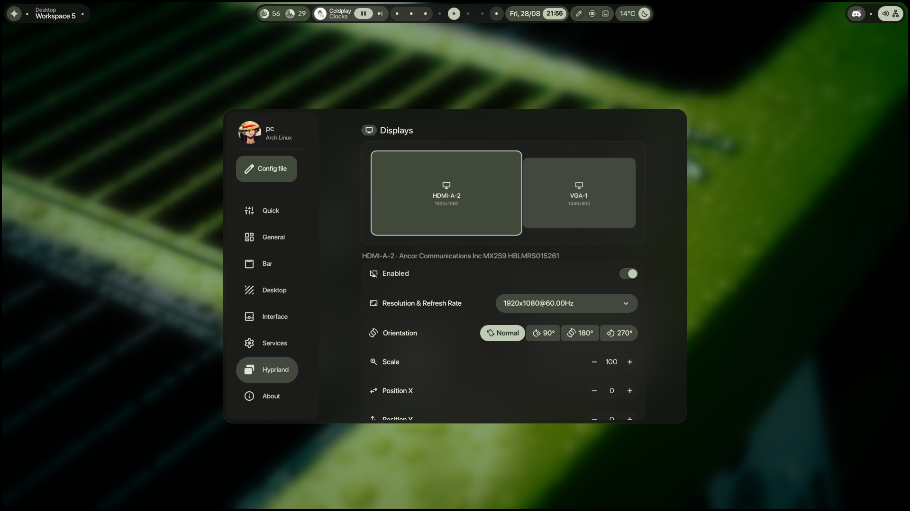

<div align="center">

# 💠 riziroo

**A personal Hyprland desktop shell — my fork of [end4-pC](https://github.com/pctrade/end4-pC), itself a fork of [illogical-impulse](https://github.com/end-4/dots-hyprland) by [@end-4](https://github.com/end-4).**

Built on Quickshell · GPL-3.0

</div>

---

## What this is

This is my daily desktop shell, kept in the open so it can be reinstalled, shown, and picked apart. It sits on top of end-4's illogical-impulse and pctrade's end4-pC, and adds the pieces I wanted for my own workflow:

- **Dynamic Island** — a notch-style bar centrepiece that expands into media, a clock, weather, search and OSD surfaces, plus **calendar, tasks, timer, AI and notification panels**.
- **Synced lyrics** with a karaoke sweep, line-by-line and plain-text views, and a **per-track sync pill** for nudging lyrics that run early or late (the offset is remembered per song).
- **A native typing test** — a Monkeytype-style test in pure QML: word / quote / zen modes, punctuation and numbers, difficulty levels, an on-screen keyboard, result graphs, saved history with replay, and a theme editor. Ships real word lists and takes drop-in language packs.
- **File search in the launcher** — type `f ` to find files and folders without leaving the Island.
- **A minimal media widget** rebuilt from the original.
- **An AmneziaVPN widget** for at-a-glance connection state.
- **AI services** wired to Claude and OpenAI-compatible backends.
- **Per-app dock glow** — each icon casts a bloom in its own colours.
- **Glass popups** frosted by the compositor, and a steadier, faster Dynamic Island.
- **Actionable notifications** — translucent toasts with a countdown ring, the sender's own actions inline, and a "+N more" pill so a burst never covers the screen.

> This is a personal setup, not a distro. It is opinionated and tuned to my machine, but it installs cleanly next to a normal illogical-impulse setup without touching it.

---

## 📸 Screenshots

<div align="center">

| 🎵 Lyrics | 🖼️ Online Wallpapers |
|:---:|:---:|
|  |  |
| 🪟 Desktop Widgets | 🔧 Hyprland Configs |
|  |  |
| ⚙️ Configurable Bar | ✨ And More |
|  |  |

</div>

---

## ⚡ Installation

> [!IMPORTANT]
> This shell **requires [illogical-impulse](https://github.com/end-4/dots-hyprland) to be installed first.** It reads illogical-impulse's `config.json` and runs helper scripts from its Python environment. It manages its own config folder and does **not** overwrite your existing `ii` setup.

```bash
cd ~/.config/quickshell
git clone https://github.com/RiZiRo/riziroo.git end4-pC
cd end4-pC
./install.sh
```

`install.sh` checks that quickshell, Hyprland and illogical-impulse are present, links this checkout in as the `end4-pC` config, installs the supervised launcher into `~/.local/bin`, and prints the keybinds to add. It refuses to run — changing nothing — if a requirement is missing or a different config directory is already in the way, so it is safe to re-run.

> [!NOTE]
> The config directory is named `end4-pC` on purpose: internal IPC names and the launcher refer to it. Cloning into that folder name is the supported path.

### Run it

```bash
~/.local/bin/start-end4-pC &
```

`start-end4-pC` supervises the shell: if quickshell crashes or is killed, it restarts it and logs why to `~/.local/state/end4-pC/`, so the desktop never drops to bare Hyprland. Use `start-end4-pC --no-supervise` to run once for troubleshooting.

> [!TIP]
> `~/.local/bin` is often missing from the graphical session's `PATH`. Use the full path in Hyprland configs and `.desktop` files.

### 🔧 Make it your default shell (optional)

Edit `~/.config/hypr/hyprland/variables.lua`:

```lua
hl.env("qsConfig", "end4-pC")
```

### ⚙️ Keybinds

Add to your Hyprland config:

```lua
hl.bind("SUPER + escape", hl.dsp.global("quickshell:settingsToggle"),
        {description = "Toggle settings"})
hl.bind("SUPER + O", hl.dsp.global("quickshell:typingTestToggle"),
        {description = "Toggle typing test"})
hl.bind("ALT + Space", hl.dsp.global("quickshell:islandToggle"),
        {description = "Toggle island search"})
hl.bind("ALT + SHIFT + Space", hl.dsp.global("quickshell:islandDashboardToggle"),
        {description = "Toggle island dashboard"})
```

Then `hyprctl reload`.

> **Note:** Settings is an overlay panel, not a regular window — `Super + Q` won't close it. Toggle it with the same keybind or press `Escape`.

> **Note:** With the Island enabled, `Super` shows workspaces only — the launcher moves to `Alt + Space`.

---

## ❓ FAQ

**How do I see my keybinds?** Open the launcher (`Alt + Space`) and type `<` — it lists every configured keybind.

**Why doesn't Settings have a search bar?** The launcher already does that job. Open it (`Alt + Space`) and type what you want (`wallpaper`, `bar`, `blur`); it matches page names and jumps you there.

**How do I find a file?** Open the launcher and type `f ` followed by part of the name.

**Lyrics are out of sync.** Click the little sync pill over the album art and nudge the offset. It's saved per track.

---

## 🙏 Credits

This stands on a lot of other people's work:

- **[@end-4](https://github.com/end-4)** — the original [dots-hyprland](https://github.com/end-4/dots-hyprland) / illogical-impulse shell this is all built on. A masterpiece of a dotfiles project. 🫡
- **[pctrade](https://github.com/pctrade/end4-pC)** — the end4-pC fork this one is based on.
- **[@gh0stzk](https://github.com/gh0stzk)** — the weather API integration behind the weather widget.
- **[@simeulinuxkaliaiwr](https://github.com/simeulinuxkaliaiwr)** — some of the shader transitions.
- The native typing test's design was informed by the GPL-3.0 **[Monkeytype](https://github.com/monkeytypegame/monkeytype)** project; see [`modules/ii/typingTest/ATTRIBUTION.md`](modules/ii/typingTest/ATTRIBUTION.md). No Monkeytype code or backend is embedded.

Licensed under **GPL-3.0**, the same as the projects it builds on. See [LICENSE](LICENSE).

---

<div align="center">

Made on top of giants — fork it and make it your own.

</div>
